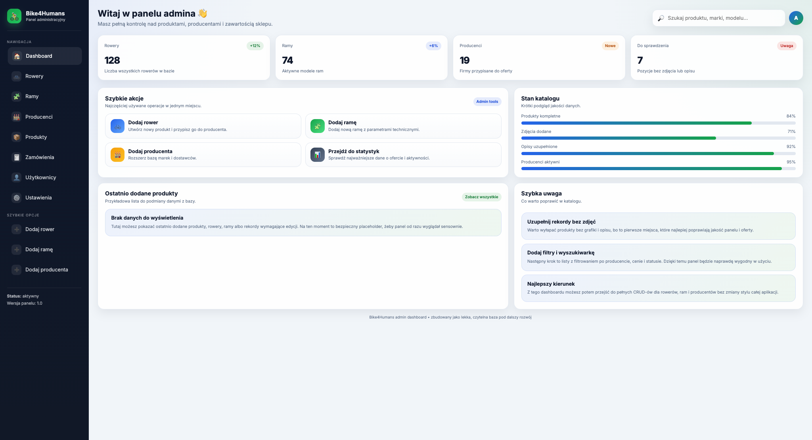
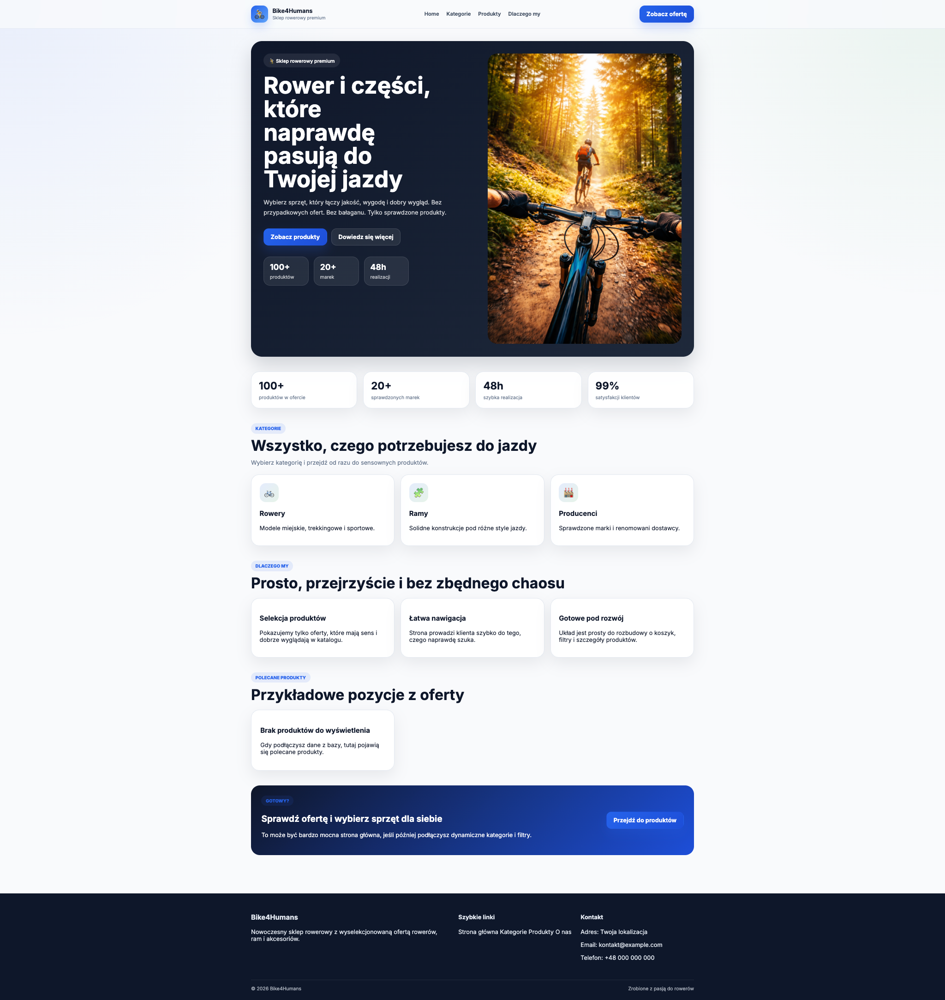

# 🚴 Bike Shop API

Backend for an online bike and accessories store, built with **Python and FastAPI**.  
This project was created as a learning exercise, focusing on **backend development**, business logic, and REST API design. The frontend was added only to visualize functionality and test the API.

Admin panel:

Homepage:

---

## 🛠 Technologies

- **Backend:** Python + FastAPI  
- **Database:** SQLite / relational database layer via SQLAlchemy  
- **ORM:** SQLAlchemy  
- **Testing:** pytest  
- **Server:** Uvicorn  
- **Frontend for basic UI:** Jinja templates  
- **Styling:** CSS, Bootstrap  
- **Optional:** local virtual environment for development  

---

## 🔑 Features

### Admin area
- Manage bikes, frames and manufacturers  
- Create, update and delete records  
- Separate admin views and forms  

### Frontend
- Public homepage with product presentation  
- Basic layout with templates and reusable components  
- Static assets for styling and images  

### Additional Components
- Data validation with Pydantic schemas  
- Repository/service layering for cleaner code  
- Database access separated from route logic  
- Basic tests setup  

---

## 🗂 Project Structure

- `app/`
  - `main.py` — application entrypoint
  - `database/` — database connection setup
  - `models/` — ORM models for bikes, frames and manufacturers
  - `repositories/` — database access layer
  - `routers/` — route definitions
    - `admin/` — admin endpoints
    - `front/` — public-facing endpoints
  - `schemas/` — Pydantic schemas
    - `admin/` — DTOs for admin operations
    - `front/` — DTOs for public views
  - `services/` — business logic
    - `admin/` — admin-related services
    - `front/` — frontend-related services
  - `templates/` — Jinja templates
    - `admin/`
    - `authentication/`
    - `front/`
  - `static/` — CSS, JS and images
    - `css/`
    - `images/`
    - `js/`
  - `core/` — shared project utilities
- `tests/` — test files
- `app.db` — local database file used during development

---

## 🎯 Learning Goals

- Backend development with FastAPI  
- REST API design and implementation  
- Database modeling with SQLAlchemy  
- Structuring a modular backend with repositories and services  
- Using Jinja templates for a simple UI  
- Separating admin and frontend concerns in the codebase  

---

## 📌 Optional Improvements

- Expand automated tests  
- Add pagination, filtering and search  
- Improve UI and responsiveness  
- Add better documentation for API endpoints  
- Consider Dockerization for easier setup and deployment
